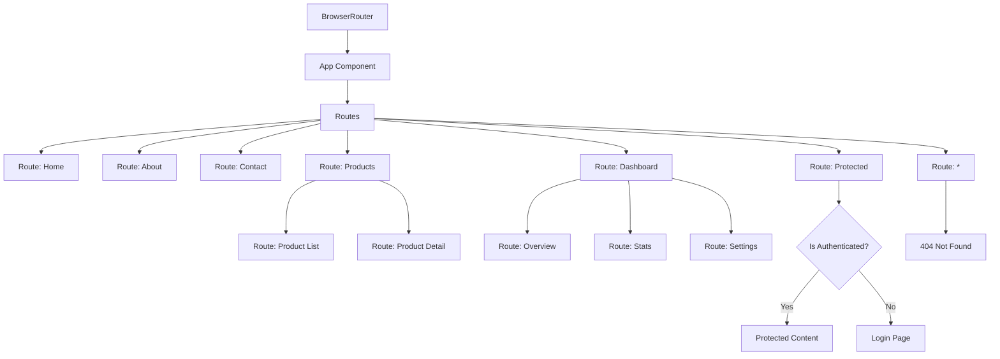
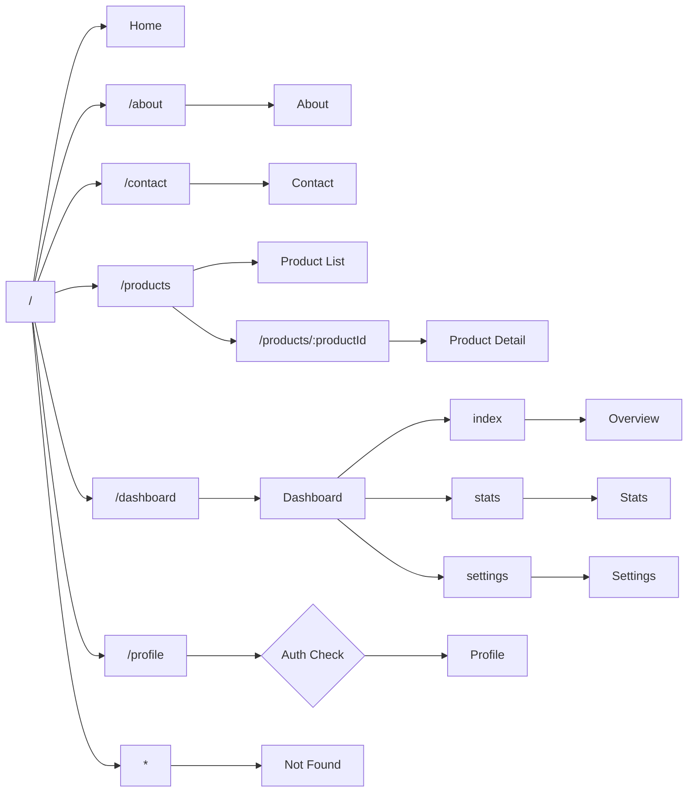

# React Router Demo Project

A comprehensive demonstration of React Router features and capabilities.

## Overview

This project showcases various features and use cases of React Router, the standard routing library for React applications. It demonstrates how to implement different routing patterns and techniques in a React application.

## Features Demonstrated

- **Basic Routing**: Simple navigation between pages
- **Route Parameters**: Dynamic routes with parameters
- **Nested Routes**: Parent/child route relationships
- **Protected Routes**: Authentication-based access control
- **Query Parameters**: URL search parameters
- **Lazy Loading**: Code-splitting with dynamic imports
- **Redirects**: Automatic redirects to other routes
- **404 Handling**: Catching unmatched routes

## React Router Concepts

React Router is a standard library for routing in React applications. It enables navigation among views in a React application, allows the browser URL to be changed, and keeps the UI in sync with the URL.

### Key Components

- **BrowserRouter**: Provides the routing context for the application
- **Routes**: Container for route definitions
- **Route**: Defines a route with a path and element to render
- **Link/NavLink**: Components for navigation without page reloads
- **Outlet**: Renders child routes in nested route configurations
- **useParams**: Hook to access route parameters
- **useSearchParams**: Hook to access and manipulate query parameters
- **useNavigate**: Hook for programmatic navigation
- **Navigate**: Component for declarative redirects

## Application Flow



## Route Structure



## Getting Started

1. Clone the repository
2. Install dependencies:
   ```
   pnpm install
   ```
3. Start the development server:
   ```
   pnpm dev
   ```

## Built With

- React
- React Router
- Vite
